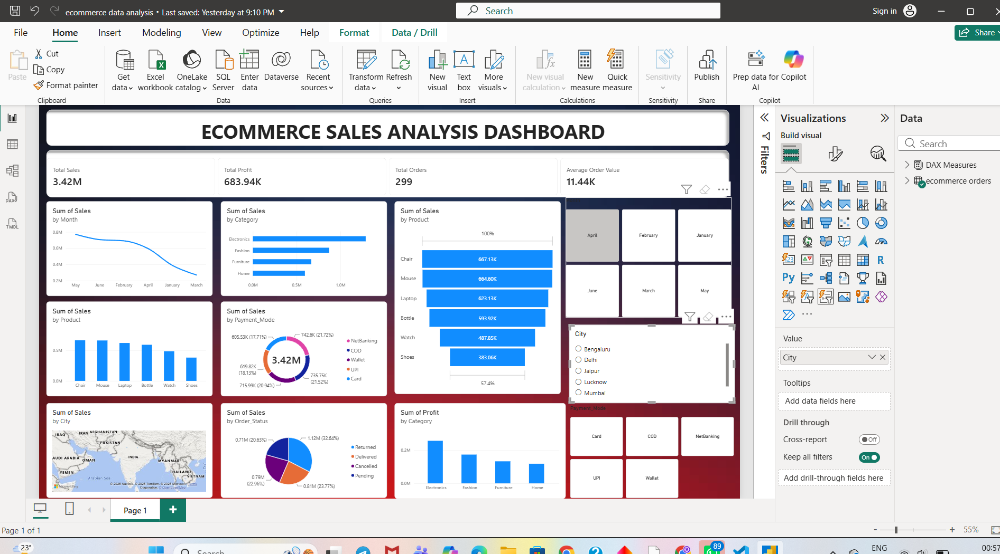
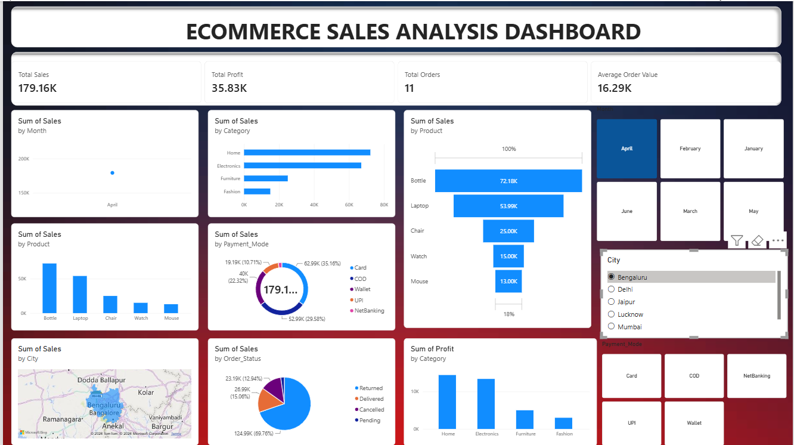
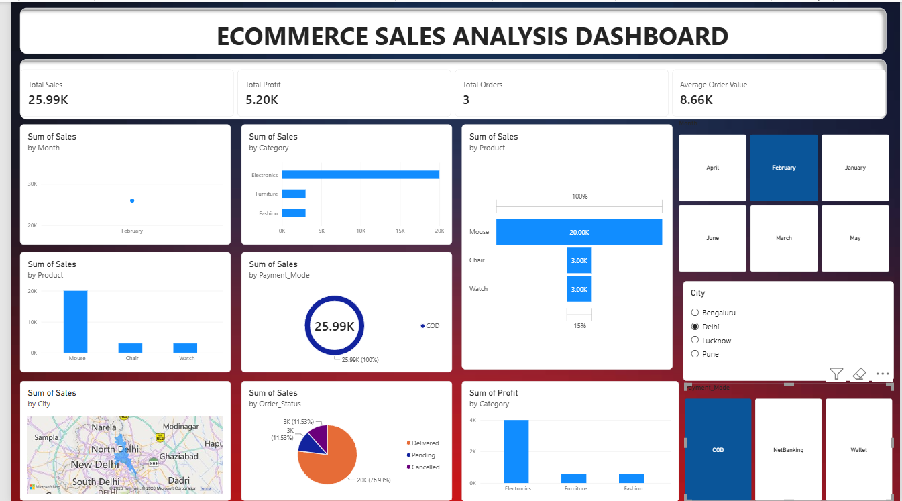

# 📊 E-Commerce Sales Analysis

An end-to-end E-Commerce Sales Analysis project using Excel, Python, Pandas, Jupyter Notebook, SQL/MySQL, and Power BI.

This project focuses on data cleaning, preprocessing, analysis, business metrics, and dashboard development to transform raw e-commerce data into meaningful insights.

---

## 📌 Project Overview

The project starts with an unclean E-Commerce dataset in Excel and follows a complete data analytics workflow:

**Raw Excel Data**  
⬇️  
**Data Cleaning & Preprocessing using Python/Pandas**  
⬇️  
**Cleaned CSV Dataset**  
⬇️  
**SQL/MySQL Analysis**  
⬇️  
**Power BI Dashboard**  
⬇️  
**Business Insights**

---

## 🎯 Project Objectives

The main objectives of this project are:

- Clean and preprocess raw E-Commerce data
- Identify and handle missing values
- Remove duplicate records
- Standardize customer and location-related data
- Validate and transform data types
- Perform exploratory data analysis
- Create useful business metrics
- Store and analyze data using MySQL
- Build an interactive Power BI dashboard
- Generate meaningful business insights

---

## 🛠️ Tools & Technologies

| Tool | Purpose |
|------|---------|
| Microsoft Excel | Raw data source |
| Python | Data processing and analysis |
| Pandas | Data cleaning and manipulation |
| NumPy | Numerical operations |
| Jupyter Notebook | Data analysis workflow |
| CSV | Cleaned dataset |
| MySQL | Database storage and SQL analysis |
| SQLAlchemy | Python-MySQL connection |
| Power BI | Interactive dashboard |
| GitHub | Project version control and portfolio |

---

## 📂 Dataset Information

### Raw Dataset

The original dataset contains:

- **524 rows**
- **15 columns**

File:

```text
data/raw/Ecommerce_Unclean_Project.xlsx


## 📊 Power BI Dashboard

### Dashboard Overview



### Sales Analysis



### Profit Analysis

